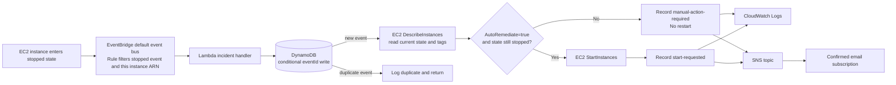

# Architecture and Event Flow

## Diagram

The Lambda execution role permits logging, `ec2:DescribeInstances`, `dynamodb:PutItem` to this lab's table, and `sns:Publish` to this topic. `ec2:StartInstances` is scoped to the lab instance and conditioned on its `AutoRemediate=true` resource tag. EventBridge has a separate Lambda resource permission allowing this rule to invoke the function.

## Event lifecycle

1. EC2 publishes an `EC2 Instance State-change Notification` event when the instance reaches `stopped`.
2. The EventBridge rule matches the event source, detail type, exact instance ARN, and `detail.state=stopped`.
3. EventBridge invokes Lambda. The function validates the event ID and instance ID, then conditionally inserts the event ID into DynamoDB. A duplicate ID is ignored.
4. Lambda reads the current instance state and tags. If the resource is no longer stopped, it reports `no-action`. If `AutoRemediate` is not `true`, it reports `manual-action-required`. Otherwise, it requests `StartInstances` and reports `start-requested`.
5. Lambda writes its incident record to CloudWatch Logs and publishes the result to SNS. SNS emails it to confirmed subscribers.

## Operational boundaries

- **Opt-in:** only resources explicitly tagged `AutoRemediate=true` can be restarted by the Lambda policy and handler.
- **Idempotency:** the conditional DynamoDB write prevents the same EventBridge event ID from being processed twice. It does not deduplicate distinct events concerning the same instance.
- **Event timing:** an EC2 state event is asynchronous. The event says it stopped, while Lambda checks the current state again before acting.
- **No SQS:** the event target is Lambda directly; this lab has no queue, dead-letter queue, or queue consumer.
- **Scope:** this is a teaching workflow, not a complete production incident-management platform.

## Console and Terraform names

The console walkthrough creates `lab1-processed-events`. Terraform creates `lab1-incident-processed-events`, using its `lab1-incident` naming prefix. The Terraform Lambda gets its table name from `DYNAMODB_TABLE_NAME`; the console Lambda should use the name of the table created in the console.
